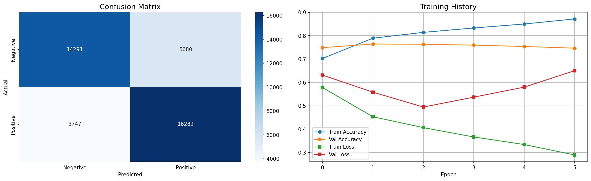

# Twitter Sentiment Analysis using ANN + LSTM

A deep learning model for classifying tweet sentiment into Positive, Negative, and Neutral categories, built with Bidirectional LSTM and GloVe embeddings, trained on the Sentiment140 dataset.

---

## Results

| Metric | Score |
|--------|-------|
| Accuracy | 76.43% |
| Precision | 76.04% |
| Recall | 87.82% |
| F1 Score | 76.00% |
| Training Time | 1m 52s |

---

## Visualizations

---

## Model Architecture

- Embedding layer (GloVe 100d, frozen)
- Bidirectional LSTM (128 units)
- Bidirectional LSTM (64 units)
- Dense (256, ReLU) + BatchNormalization + Dropout
- Dense (128, ReLU) + BatchNormalization + Dropout
- Dense (1, Sigmoid output)

---

## Tech Stack

- TensorFlow / Keras
- Bidirectional LSTM
- GloVe 100d Pre-trained Embeddings
- NLTK (stopwords, stemming)
- Scikit-learn
- Pandas, NumPy, Matplotlib, Seaborn

---

## Dataset

Sentiment140 — 1.6 million tweets labeled positive/negative.
200K sample used for training with 80/20 train/test split.
Source: https://www.kaggle.com/datasets/kazanova/sentiment140

---

## Sample Predictions

| Tweet | Sentiment | Confidence |
|-------|-----------|------------|
| I love this product, absolutely amazing | POSITIVE | 78% |
| This is the worst experience ever | NEGATIVE | 62% |
| The weather today is okay I guess | NEUTRAL | 93% |
| Not sure how I feel about this | NEUTRAL | 98% |

